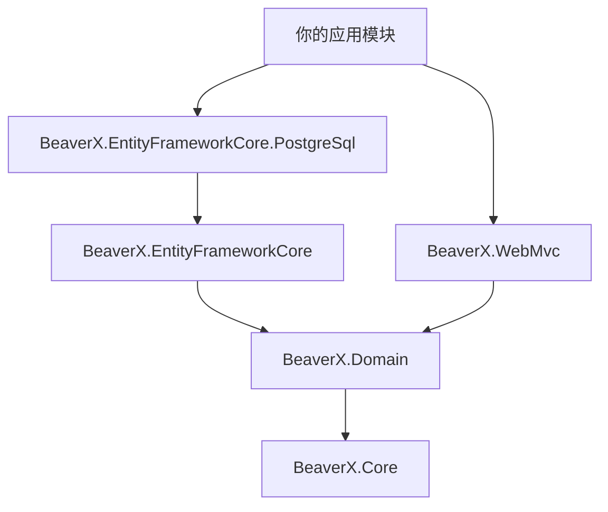

# BeaverX.NET

[](LICENSE)
[](https://dotnet.microsoft.com/)

**BeaverX** 是一套面向现代 .NET 的轻量级模块化快速开发框架。借鉴 ABP 的模块与 DDD 分层思想，但更精简、白盒、易扩展：模块依赖拓扑排序、约定式依赖注入、泛型仓储自动注册、审计与软删除开箱即用。

所有核心库已发布到 [NuGet.org](https://www.nuget.org/packages?q=BeaverX)。

---

## 包一览

| NuGet 包 | 版本（当前仓库） | 职责 |
|----------|------------------|------|
| [BeaverX.Core](https://www.nuget.org/packages/BeaverX.Core) | `1.0.0-preview.3` | 模块化引擎、模块生命周期、`DependsOn` 依赖解析、约定式 DI 扫描 |
| [BeaverX.Domain](https://www.nuget.org/packages/BeaverX.Domain) | `1.0.0-preview.4` | 领域契约：实体基类、审计接口、仓储接口、`ICurrentUser`、`IUnitOfWork` |
| [BeaverX.EntityFrameworkCore](https://www.nuget.org/packages/BeaverX.EntityFrameworkCore) | `1.0.0-preview.4` | EF Core 基础设施：`BeaverXDbContext`、泛型仓储实现、`AddBeaverXDbContext` |
| [BeaverX.EntityFrameworkCore.PostgreSql](https://www.nuget.org/packages/BeaverX.EntityFrameworkCore.PostgreSql) | `1.0.0-preview.4` | PostgreSQL 驱动（Npgsql）与工作单元实现 |
| [BeaverX.WebMvc](https://www.nuget.org/packages/BeaverX.WebMvc) | `1.0.0-preview.4` | Web 表现层：`BeaverXController` 基类、`HttpContext` 当前用户 |

依赖关系（自下而上）：



---

## 各包说明

### BeaverX.Core

框架的「启动引擎」，通常由 **ASP.NET Core 宿主项目** 引用（通过 `WebApplicationBuilder` 扩展）。

- **`BeaverXModule`**：所有模块的基类，提供 `ConfigureServices` 与 `OnApplicationInitialization` 两个生命周期钩子。
- **`[DependsOn(typeof(...))]`**：声明模块依赖；引擎会做拓扑排序，并检测循环依赖。
- **约定式 DI**：在模块所在程序集中，实现 `ITransientDependency` / `IScopedDependency` / `ISingletonDependency` 的类会自动注册到容器（并绑定其实现的接口）。

```csharp
// Program.cs
builder.AddBeaverX<YourAppModule>();
var app = builder.Build();
app.InitializeBeaverX();
```

### BeaverX.Domain

纯领域契约层，**不依赖 EF 或 ASP.NET**。适合被应用层、领域服务、以及 EF 包共同引用。

- **实体**：`Entity<TKey>`、`Entity`（默认 `long` 主键）、`FullAuditedEntity` 等审计基类。
- **软删除**：`ISoftDelete` 标记接口（具体过滤与拦截在 EF 包中实现）。
- **仓储契约**：`IRepository<TEntity, TKey>`、`IRepository<TEntity>`（`long` 主键简写）。
- **当前用户**：`ICurrentUser`（默认 `NullCurrentUser`，Web 场景由 WebMvc 替换）。
- **工作单元**：`IUnitOfWork` 契约（PostgreSQL 包提供实现）。

业务服务只需依赖接口，例如：

```csharp
public class OrderService : IScopedDependency
{
    private readonly IRepository<Order> _orders;
    public OrderService(IRepository<Order> orders) => _orders = orders;
}
```

> 在类上标记 `IScopedDependency` 等接口即可被 Core 自动注册，无需手写 `services.AddScoped`。

### BeaverX.EntityFrameworkCore

将 Domain 中的仓储契约落地到 **EF Core**。

- **`BeaverXDbContext<TDbContext>`**：
  - 对实现 `ISoftDelete` 的实体自动添加 `IsDeleted == false` 全局查询过滤器；
  - 在 `SaveChanges` 时自动填充创建/修改审计字段；
  - 将物理删除转换为软删除（若实体支持软删除与删除审计）。
- **`AddBeaverXDbContext<TDbContext>(connectionString)`**：
  - 注册 `DbContext`；
  - 扫描 `DbSet<>` 属性，按实体主键类型自动注册 `IRepository<TEntity, TKey>`（`long` 主键时同时注册 `IRepository<TEntity>`）。

需要配合**某一数据库驱动包**（如 PostgreSQL）提供的 `IDbDriverOptionsBuilder`。

### BeaverX.EntityFrameworkCore.PostgreSql

PostgreSQL 官方适配包，基于 **Npgsql**。

- 注册 `PostgreSqlDbDriverOptionsBuilder`，在 `AddBeaverXDbContext` 内部调用 `UseNpgsql`。
- 注册 `IUnitOfWork` 实现，通过 `ExecuteAsync` 在 `ExecutionStrategy` 可重试块内执行并提交事务（兼容 `EnableRetryOnFailure`）。

若使用其他数据库，可参考本包实现自定义的 `IDbDriverOptionsBuilder` 与 `IUnitOfWork`。

### BeaverX.WebMvc

ASP.NET Core **Web API / MVC** 表现层集成。

- **`BeaverXController`**：统一 `[ApiController]` + `api/[controller]` 路由，并提供 `CurrentUser` 属性。
- 将 Domain 中的 `ICurrentUser` 替换为基于 `HttpContext` 的 `HttpContextCurrentUser`。

控制台应用、Worker 等无 HTTP 场景可只引用 Domain，继续使用 `NullCurrentUser`。

---

## 快速开始

以下步骤从零搭建一个带 PostgreSQL 的 Web API。完整示例见仓库 [`src/samples/BeaverX.Sample.HttpApi`](src/samples/BeaverX.Sample.HttpApi)。

### 环境要求

- [.NET 10 SDK](https://dotnet.microsoft.com/download)
- PostgreSQL（或修改连接字符串指向你的实例）

### 1. 创建项目并安装 NuGet 包

```bash
dotnet new web -n MyApp
cd MyApp

dotnet add package BeaverX.Core --version 1.0.0-preview.3
dotnet add package BeaverX.Domain --version 1.0.0-preview.4
dotnet add package BeaverX.EntityFrameworkCore --version 1.0.0-preview.4
dotnet add package BeaverX.EntityFrameworkCore.PostgreSql --version 1.0.0-preview.4
dotnet add package BeaverX.WebMvc --version 1.0.0-preview.4
```

> Web 宿主需要引用 **Core**；业务/数据层通常引用 **Domain** + **EF** + **数据库驱动**；有 HTTP API 时再引用 **WebMvc**。版本号请与 [NuGet](https://www.nuget.org/packages?q=BeaverX) 上已发布版本保持一致。

### 2. 定义启动模块（串联各层）

```csharp
using BeaverX.Core.Modules;
using BeaverX.EntityFrameworkCore.DependencyInjection;
using BeaverX.EntityFrameworkCore.PostgreSql;
using BeaverX.WebMvc;

namespace MyApp;

[DependsOn(typeof(BeaverXEntityFrameworkCorePostgreSqlModule), typeof(BeaverXWebMvcModule))]
public class MyAppModule : BeaverXModule
{
    public override void ConfigureServices(ServiceConfigurationContext context)
    {
        context.Services.AddControllers();
        context.Services.AddBeaverXDbContext<MyDbContext>(
            context.Configuration.GetConnectionString("Default")!);
    }

    public override void OnApplicationInitialization(ApplicationInitializationContext context)
    {
        var app = (WebApplication)context.App;
        app.UseHttpsRedirection();
        app.MapControllers();
    }
}
```

### 3. 配置 `Program.cs`（Core 入口）

```csharp
using BeaverX.Core;
using MyApp;

var builder = WebApplication.CreateBuilder(args);
builder.AddBeaverX<MyAppModule>();

var app = builder.Build();
app.InitializeBeaverX();
app.Run();
```

### 4. 领域层：实体与服务（BeaverX.Domain）

```csharp
using BeaverX.Core.Dependency;
using BeaverX.Domain.Entities;
using BeaverX.Domain.Repositories;

namespace MyApp.Models;

// 默认推荐 long 雪花 ID
public class Product : FullAuditedEntity
{
    public string Name { get; set; } = null!;
}

public class ProductService : IScopedDependency
{
    private readonly IRepository<Product> _repository;
    public ProductService(IRepository<Product> repository) => _repository = repository;

    public Task<List<Product>> GetAllAsync() => _repository.GetListAsync();
}
```

也可使用自定义主键，例如 `Entity<Guid>`，并注入 `IRepository<User, Guid>`（示例项目即采用此方式）。

### 5. 数据层：DbContext（BeaverX.EntityFrameworkCore + PostgreSql）

```csharp
using BeaverX.Domain.Users;
using BeaverX.EntityFrameworkCore.Contexts;
using Microsoft.EntityFrameworkCore;
using MyApp.Models;

namespace MyApp;

public class MyDbContext : BeaverXDbContext<MyDbContext>
{
    public MyDbContext(DbContextOptions<MyDbContext> options, ICurrentUser currentUser)
        : base(options, currentUser) { }

    public DbSet<Product> Products { get; set; }
}
```

`appsettings.json`：

```json
{
  "ConnectionStrings": {
    "Default": "Host=localhost;Port=5432;Database=myapp;Username=postgres;Password=your_password"
  }
}
```

应用数据库迁移（按需）：

```bash
dotnet ef migrations add Initial
dotnet ef database update
```

注册 `AddBeaverXDbContext` 后，**无需手动** `AddScoped<IRepository<Product>, ...>`，框架会根据 `DbSet<>` 自动绑定仓储。

### 6. 表现层：控制器（BeaverX.WebMvc）

```csharp
using BeaverX.WebMvc.Controllers;
using Microsoft.AspNetCore.Mvc;
using MyApp.Models;

namespace MyApp.Controllers;

public class ProductController : BeaverXController
{
    private readonly ProductService _productService;
    public ProductController(ProductService productService) => _productService = productService;

    [HttpGet("list")]
    public Task<List<Product>> GetListAsync() => _productService.GetAllAsync();
}
```

路由示例：`GET /api/Product/list`。控制器内可通过 `CurrentUser` 访问当前登录用户 ID（需自行实现认证并填充 `HttpContext.User`）。

### 7. 工作单元（可选，PostgreSql 包）

需要**多步写操作同一事务提交 / 异常整体回滚**时，注入 `IUnitOfWork`。框架只提供单一入口：

```csharp
Task ExecuteAsync(Func<CancellationToken, Task> action, CancellationToken cancellationToken = default);
```

委托内的查询、`SaveChanges`（含仓储默认 `autoSave: true`）都在同一 `ExecutionStrategy` 与物理事务中执行；委托正常结束则提交，抛出异常则回滚。

**多步写入示例：**

```csharp
public class OrderAppService : IScopedDependency
{
    private readonly IUnitOfWork _uow;
    private readonly IRepository<Order> _orders;

    public OrderAppService(IUnitOfWork uow, IRepository<Order> orders)
    {
        _uow = uow;
        _orders = orders;
    }

    public Task CreateWithTransactionAsync(Order order, CancellationToken cancellationToken = default)
    {
        return _uow.ExecuteAsync(async ct =>
        {
            await _orders.InsertAsync(order, cancellationToken: ct);
            // 更多写操作...
        }, cancellationToken);
    }
}
```

**先查后改（推荐查询也放在委托内）：**

```csharp
await _uow.ExecuteAsync(async ct =>
{
    var order = await _orders.FindAsync(orderId, ct)
        ?? throw new InvalidOperationException("订单不存在");

    order.Status = OrderStatus.Paid;
    await _orders.UpdateAsync(order, cancellationToken: ct);
}, cancellationToken);
```

也可在 `ExecuteAsync` **外**先查询，在委托内用已跟踪实体更新（同一 Scoped `DbContext`、勿 `AsNoTracking`）。更稳妥的做法是把查询一并放进委托。

**控制器示例（批量删除，异常回滚）：**

```csharp
[HttpDelete("users")]
public async Task<string> DeleteUsersAsync(string ids, CancellationToken cancellationToken)
{
    try
    {
        await _uow.ExecuteAsync(async ct =>
        {
            foreach (var id in ids.Split(','))
            {
                await _userRepository.DeleteAsync(long.Parse(id), cancellationToken: ct);
            }
        }, cancellationToken);
        return "ok";
    }
    catch
    {
        return "fail";
    }
}
```

**嵌套调用：**内层 `ExecuteAsync` 只执行委托，不新开事务，由最外层统一 `SaveChanges` 并提交：

```csharp
await _uow.ExecuteAsync(async ct =>
{
    await _orders.InsertAsync(order, cancellationToken: ct);

    await _uow.ExecuteAsync(async ctInner =>
    {
        await _orderItems.InsertManyAsync(items, cancellationToken: ctInner);
    }, ct);
}, cancellationToken);
```

**注意：**

1. 事务边界 = 一次最外层 `ExecuteAsync`；勿在委托外做需要与委托内写入同一事务的 `SaveChanges`。
2. 委托内避免长时间非数据库 IO，以免拉长事务持有时间。
3. `DeleteManyAsync(表达式)` 直接执行 SQL，绕开变更跟踪，不适合放在需要与实体操作同一事务回滚的场景。

---

## 按场景选择包

| 场景 | 建议引用的包 |
|------|----------------|
| 仅模块化 + 约定 DI（控制台、Worker） | `BeaverX.Core`、`BeaverX.Domain` |
| 领域模型 + 仓储接口，无数据库 | `BeaverX.Domain` |
| EF Core + 仓储实现，数据库无关 | `BeaverX.EntityFrameworkCore` + 自定义 `IDbDriverOptionsBuilder` |
| PostgreSQL 项目 | 上表 + `BeaverX.EntityFrameworkCore.PostgreSql` |
| Web API / MVC | 再加 `BeaverX.WebMvc` |

---

## 本地运行示例

```bash
cd src/samples/BeaverX.Sample.HttpApi
# 在 appsettings.Development.json 中配置 ConnectionStrings:Default
dotnet run
```

示例接口：

- `GET /api/Test/sayHello?nickname=Beaver`
- `GET /api/Test/userList`

---

## 仓库结构

```
src/
├── BeaverX.Core/
├── BeaverX.Domain/
├── BeaverX.EntityFrameworkCore/
├── BeaverX.EntityFrameworkCore.PostgreSql/
├── BeaverX.WebMvc/
└── samples/BeaverX.Sample.HttpApi/
```

---

## 参与与许可

- 问题与讨论：[GitHub Issues](https://github.com/hdonghua/BeaverX.NET/issues)
- 许可协议：[MIT](LICENSE)

欢迎 Star、Issue 与 PR。
